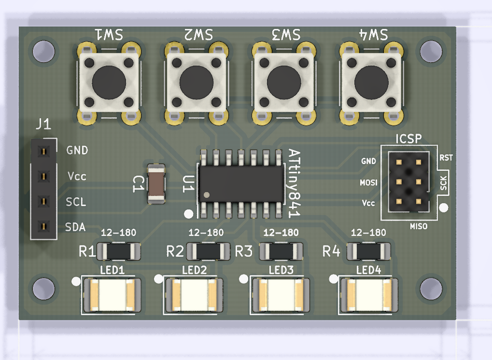
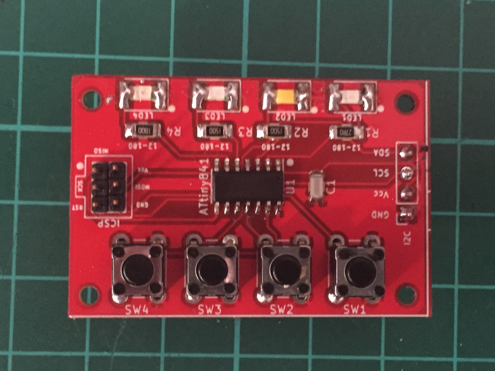

# Arduino library for the I2C_ADW0720 boards

<p>Find the project description at <a href="https://willem.aandewiel.nl/index.php/2020/08/10/extending-gpio-pins-on-your-micro-processor/">www.aandewiel.nl</a>.</p>
<br>

This library gives an interface between your own program and the I2C_ADW0720 board.

<center></center>

To use it you have to include this library in your sketch

```
#include <I2C_ADW0720.h>
```

Declare an Extender object (declare one for every I2C_ADW0720 board):

```
I2CADW0720 ExtenderBoard; // Create instance of the I2CADW0720 object
```

In the main <code>loop()</code>.

```
void loop() 
{
  byte statusReg, sysStatus;
  
  sysStatus = ExtenderBoard.getSysStatus();
  if (sysStatus == 0) return;
  
  if (bitRead(sysStatus, 1))
  {
    statusReg = ExtenderBoard.getSlotStatus(4);
    if (statusReg != 0) 
    {
      if (ExtenderBoard.isSlotPressed(4) ) 
      {
        Serial.println(F("(slot4)-------> Button Pressed"));
      }
      if (ExtenderBoard.isSlotQuickReleased(4) ) 
      {
        Serial.println(F("(slot4)-------> Quick Release "));
        ExtenderBoard.setOutputToggle(1, HIGH, 5000);
      }
      if (ExtenderBoard.isSlotMidReleased(4) ) 
      {
        Serial.println(F("(slot4)-------> Mid Release   "));
        ExtenderBoard.setOutputPulse(1, 250, 500, 0);
      }
      if (ExtenderBoard.isSlotLongReleased(4) ) 
      {
        Serial.println(F("(slot4)-------> Long Release  "));
        ExtenderBoard.setOutputPulse(1, 1000, 1700, 10000);
      }
    } // statusReg != 0
  }

}	// loop()
```

<center></center>

The library gives you the following setters:

| Setter             | Returns | Parms    | Description             |
|:-------------------|:-------:|:---------|:------------------------|
| setModeOutput(Slot)    | bool    | uint8_t  | set (slot) as OUTPUT pin|
| setModeInput(Slot)     | bool    | uint8_t  | set (slot) as INPUT-PULLUP pin|
| setOutputToggle(Slot,{HIGH|LOW},1000)  | bool    | uint8_t, bool, uint16_t  | Toggel (slot, on/off, duration (ms))|
| setOutputPulse(Slot,500,750,10000)   | bool    | uint8_t, uint16_t, uint16_t, uint16_t  | set pulse (slot, on (ms), off (ms), duration (ms))|
| setDebounceTime(100)  | bool    | uint8_t  | set the Debounce Time of the switch (5 .. 250 micro seconds)|
| setMidPressTime(1000)  | bool    | uint16_t | set the Mid Press Time of the switch (100 .. 5000 milli seconds)|
| setLongPressTime(3000) | bool    | uint16_t | set the Long Press Time of the switch (300 .. 10000 milli seconds)|
| setI2Caddress(0x18)    | bool    | uint8_t  | set a new I2C address for this Slave (1 .. 127)|
| writeCommand()     | bool    | uint8_t  | write a command to the Slave (CMD_READCONF \| CMD_WRITECONF \| CMD_REBOOT)|

The library gives you the following getters:

| Getter              | Returns  | Parms | Description |
|:--------------------|:--------:|:-----:|:------------|
| isConnected()       | bool     | none  | returns true if connected, otherwise false
| getSysStatus()      | uint8_t  | none  | returns the status byte
| getSlotStatus(Slot) | uint8_t  | uint8_t | returns the status of the selected slot
| getWhoAmI()         | int8_t   | none  | returns the Address Register
| getDebounceTime()   | uint8_t  | none  | returns the Debounce Time of the switch (5 .. 250 micro seconds)
| getMidPressTime()   | uint16_t | none  | returns the Mid Press Time of the switch (100 .. 5000 milli seconds)
| getLongPressTime()  | uint16_t | none  | returns the Long Press Time of the switch (300 .. 10000 milli seconds)
| getModeSettings()   | uint8_t  | none  | returns the input/output mode settings for all the Slots
| getMajorRelease()   | uint8_t  | none  | returns the Major Firmware Release byte (0 .. 255)
| getMinorRelease()   | uint8_t  | none  | returns the Minor Firmware Release byte (0 .. 255)

And the library gives you the following helpers:

| Helper                   | Returns | Parms | Description |
|:-------------------------|:-------:|:-----:|:------------|
|isSlotPressed(Slot)       | bool    | uint8_t | true if the Button of slot is pressed
|isSlotQuickReleased(Slot) | bool    | uint8_t | true if the Button is released before midPressTime
|isSlotMidReleased(Slot)   | bool    | uint8_t | true if the Button is released between midPressTime and longPressTime
|isSlotLongReleased(Slot)  | bool    | uint8_t | true if the Button is released after longPressTime


<center></center>
